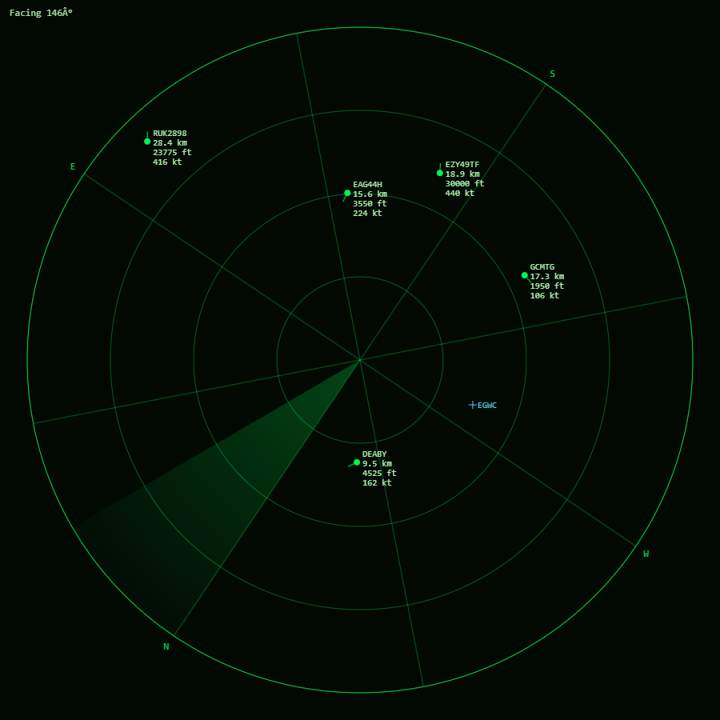
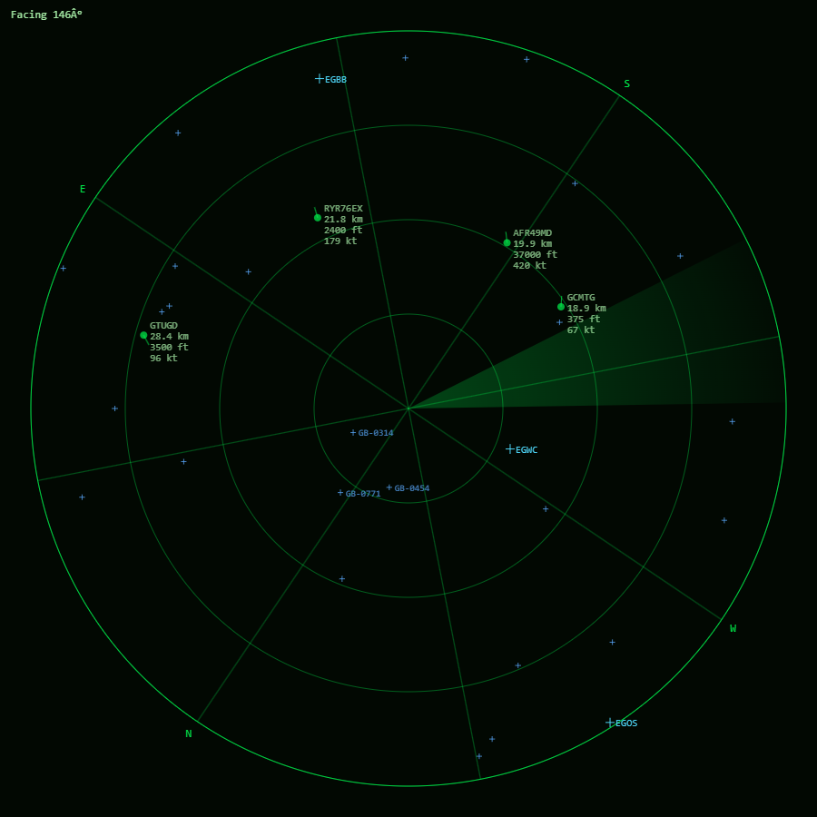
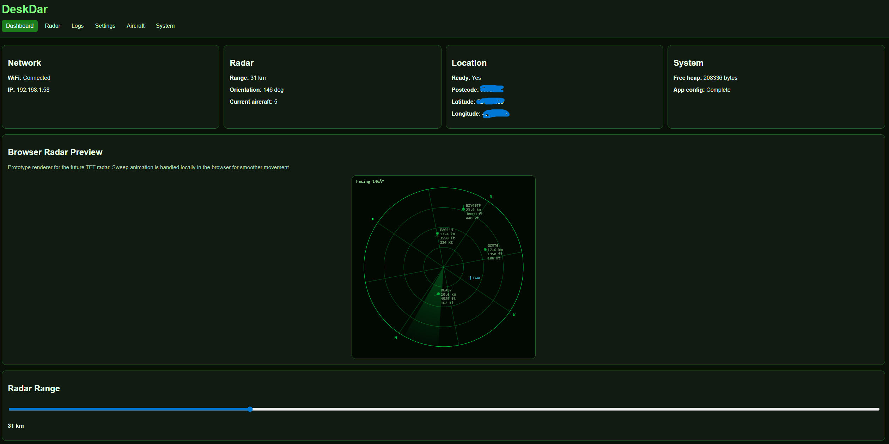
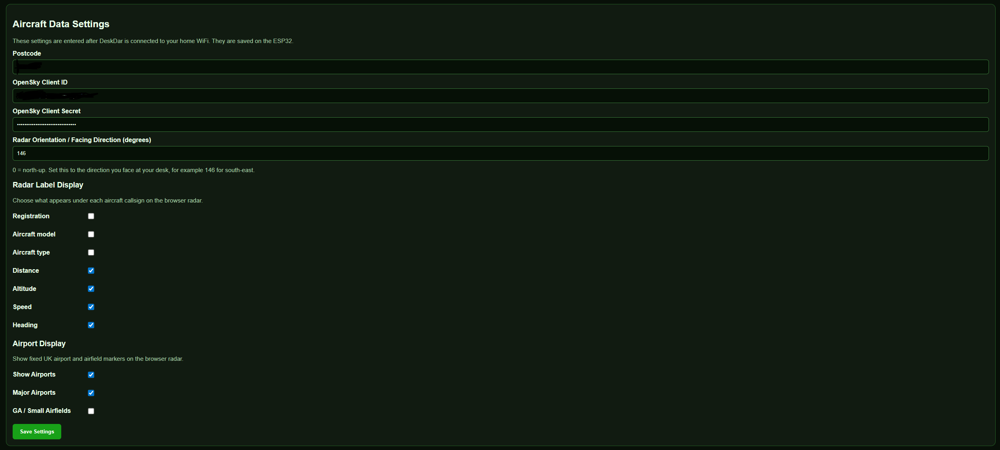
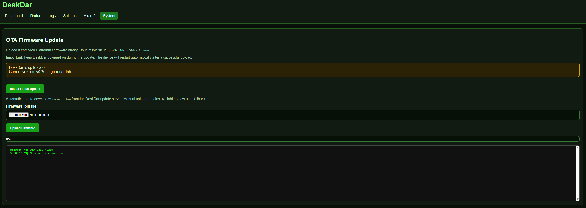

# DeskDar

> A live aircraft radar appliance powered by ESP32, OpenSky Network, browser radar rendering, OTA updates, and real-time aircraft prediction.

---

## Overview

DeskDar is a standalone ESP32-based live radar display designed to track nearby aircraft in real time.

It combines:

* Live OpenSky aircraft tracking
* Browser-based animated radar
* Aircraft prediction/interpolation
* UK airport overlays
* OTA firmware updates
* Automatic HTTP OTA updating
* Persistent configuration
* Orientation-aware radar rendering
* Dedicated large radar display mode

The project is designed to evolve into a dedicated desktop radar instrument with TFT display support and automatic compass-based orientation.

---

# Features

## Live Browser Radar

* Real-time aircraft rendering
* Smooth animated radar sweep
* Aircraft motion prediction between API refreshes
* Fade-based freshness system
* Adjustable radar range
* Orientation-aware rendering
* Large dedicated radar page

### Radar View





---

## UK Airport Overlay System

DeskDar includes UK airport and airfield overlays directly on the radar.

Supported:

* Major airports
* General aviation airfields
* ICAO labels
* Range-based filtering
* Independent enable/disable controls

### Airport Overlay Example





---

## Live Dashboard

DeskDar includes a full browser dashboard for:

* Device status
* Radar preview
* Aircraft information
* Logs
* Settings
* OTA updates

### Dashboard Example






---

## OTA Firmware Updates

DeskDar supports:

* Manual browser OTA uploads
* HTTP OTA updates
* Automatic firmware version checking
* OTA progress feedback
* OTA update logs

### OTA Update Page





---

# Hardware

## Current Hardware

* ESP32 Dev Board
* WiFi connection
* Browser-based radar renderer

## Planned Hardware

* TFT radar display
* QMC5883L compass module
* Automatic radar orientation
* Physical enclosure

---

# Browser Pages

| Page        | Purpose              |
| ----------- | -------------------- |
| `/`         | Dashboard            |
| `/radar`    | Large radar view     |
| `/logs`     | Live logs            |
| `/ota`      | OTA updates          |
| `/settings` | Device configuration |

---

# Radar Features

## Aircraft Prediction

DeskDar predicts aircraft movement between OpenSky refreshes using:

* Heading
* Speed
* Elapsed time

This creates smooth aircraft movement even with lower API refresh intervals.

---

## Orientation-Aware Radar

The radar can rotate relative to:

* Manual desk orientation
* Future compass heading input

This allows the radar to align with the real-world direction the device is facing.

---

# Installation

## 1. Flash Initial Firmware

Use PlatformIO or ESP Web Tools to flash the firmware to the ESP32.

---

## 2. Connect To Setup Portal

On first boot DeskDar creates:

```text
DeskDar Setup
```

Connect and enter:

* WiFi SSID
* WiFi password

---

## 3. Open DeskDar Dashboard

After connecting to WiFi, access DeskDar via:

```text
http://<ESP32-IP>
```

Then configure:

* Postcode
* OpenSky credentials
* Radar preferences

---

# HTTP OTA Update System

DeskDar supports automatic firmware updates using:

```text
/docs/latest.txt
/docs/firmware.bin
```

## Release Workflow

### Build firmware

```bash
aio run
```

### Copy firmware

Copy:

```text
.pio/build/esp32dev/firmware.bin
```

to:

```text
/docs/firmware.bin
```

### Update latest version

Edit:

```text
/docs/latest.txt
```

Example:

```text
v0.20-large-radar-tab
```

### Push release

```bash
git add .
git commit -m "release: publish firmware"
git push origin main
```

---

# Project Status

Current status:

* Stable browser radar
* Stable OTA updates
* Stable HTTP OTA updates
* Airport overlay system complete
* TFT integration pending
* Compass integration pending

---

# Future Roadmap

* TFT radar rendering
* Compass auto-orientation
* Compass calibration
* Aircraft trails
* Audio alerts
* Fullscreen kiosk mode
* Aircraft history playback
* Touchscreen support

---

# License

MIT License
